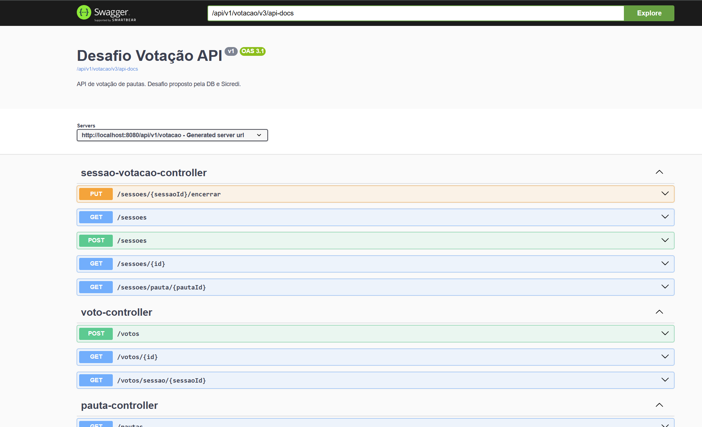
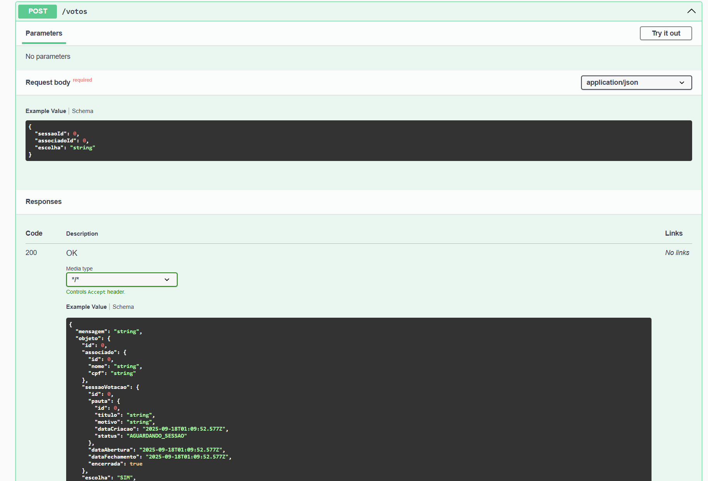
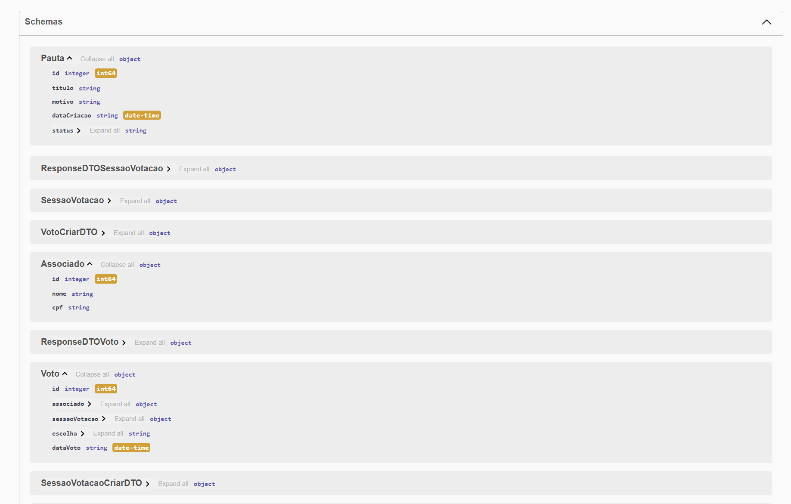

# Documentação Desafio Votação – API de Gestão de Pautas, Sessões e Votos

## Objetivo

Este projeto é uma API REST desenvolvida em Java com Spring Boot, que permite o gerenciamento de pautas de votação, abertura de sessões, cadastro de associados e registro de votos, simulando o processo de uma assembleia.

### Funcionalidades:
- **Cadastro de pauta**
- **Cadastro de Associados**
- **Abrir uma sessão de votação de uma determinada Pauta**
- **Cadastrar os votos dos associados na sessão**
- **Realizar o veredito da Pauta, após o fim da sessão**

## Tecnologias do Projeto
- **Java 21**
- **Spring Boot V3**
- **Maven**
- **Banco de Dados: Postgre**

## Bibliotecas utilizadas
- **Lombok** - Acelera o desenvolvimento, reduz código repetitivo e melhora a legibilidade do código.
- **Flywaydb** - Garante a automação, controle de versões e consistência das migrações do banco de dados em diferentes ambientes. (o arquivo de script de tabelas utilizado nesse desafio está presente no projeto).
- **Springdoc** - O Swagger muito bom para documentar os endpoints e trazer exemplos de uso.
- **JUnit e Mockito** - Criei testes unitários das funcionalidades, utilizei os dois pois são amplamente utilizados no mercado e tem boas funcionalidades.

## Documentação

Como dito nas bibliotecas utilizadas, o Swagger está presente no projeto, trazendo uma documentação dos endpoints.

Link: http://localhost:8080/api/v1/votacao/swagger-ui/index.html#/

Exemplos:

## Considerações 

- Uma Pauta poderá ter somente uma sessão vinculada.

- No arquivo de properties adicionei uma propriedade para limitar a minutagem de uma sessão caso queira, se nao estiver presente, é desconsiderado, e se caso a duração não for informada ao criar uma sessão, mantém os 60 segundos padrão.

- Não é possivel votar após o tempo da sessão terminar.

- Somente um voto de associado por sessão.

- Somente votos de sim e nao, o código verifica alguns casos de digitação dos votos, por exemplo: SIM, sim e s -> Voto SIM. Nao, nao, não e n -> Voto Não.

- O endpoint de encerrarSessao, verifica os votos e seta o veredito na pauta, sendo eles: APROVADA e REJEITADA. (caso os votos de sim e nao empatem, a pauta será rejeitada, pois não alcançou maioria favóravel)

- Desafio bônus do CPF implementado.

- Consegui realizar o desafio e gostei bastante, trabalha bem com a lógica de crud e relações entre entidades. 